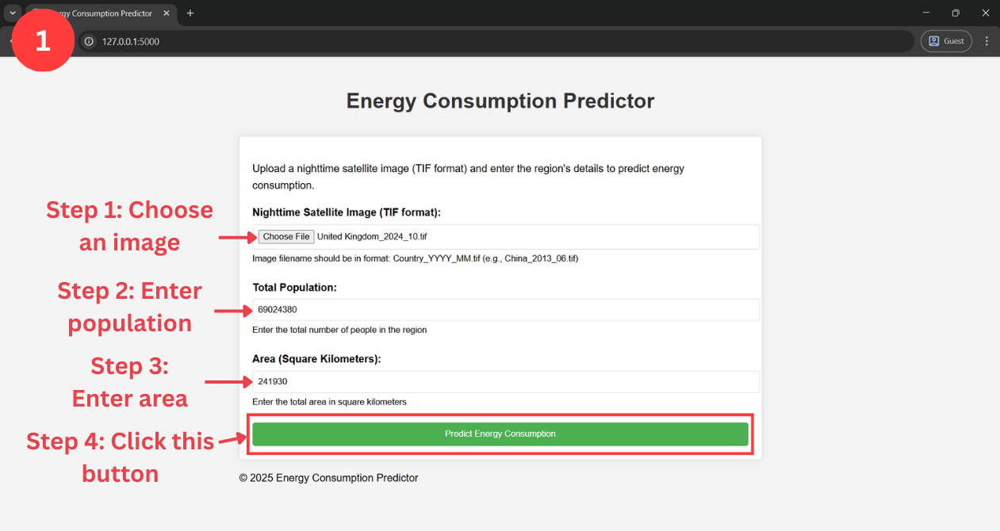
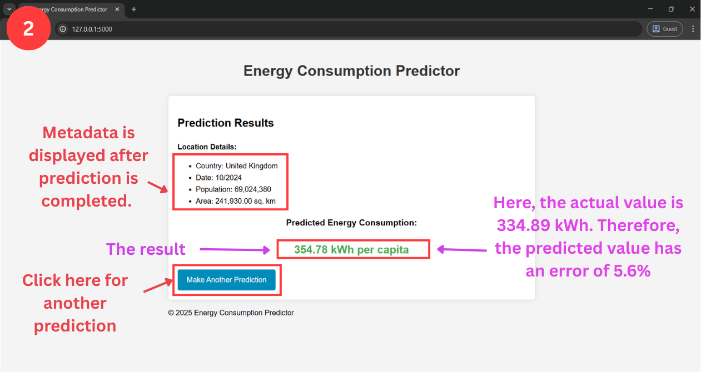

# ACEPnet (Attention based Convolutional Energy Prediction Network)

A web application of ACEPnet that predicts energy consumption based on nighttime satellite imagery and regional statistics.

## Overview

This application uses a deep learning model to predict energy consumption per capita by analyzing nighttime satellite imagery along with population and area data. The model combines CNN-based image processing with demographic features to make accurate predictions.

## License

This project is licensed under the [Creative Commons Attribution 4.0 International License (CC BY 4.0)](https://creativecommons.org/licenses/by/4.0/).
You are free to share and adapt the material for any purpose, even commercially, as long as you provide appropriate credit.

## Citation

If you use this software, please cite:

Mahinur Rashid, Kazi Iftekharul Adnan. "https://github.com/mahinur-rashid/ACEPnet". 2025.  
See [CITATION.cff](./CITATION.cff) for citation metadata.

## Requirements

- Python 3.8 or higher
- See requirements.txt for all Python dependencies

## Setup

1. Clone the repository:
```bash
git clone https://github.com/mahinur-rashid/ACEPnet.git
cd ACEPnet
```
2. Create a virtual environment:
```bash
python -m venv venv
source venv/bin/activate  # On Windows: venv\Scripts\activate
```
3. Install dependencies:
```bash
pip install -r requirements.txt
```
4. Ensure the `models` directory contains:
   - best_model.pth
   - feature_scaler.joblib
   - target_scaler.joblib

## Usage

1. Start the Flask server:
```bash
python app.py
```
2. Visit `http://localhost:5000` in your web browser
3. Upload a nighttime satellite image (TIF format)
4. Enter population and area data
5. Submit to get the energy consumption prediction

## Application Screenshots

### Input Interface
The application provides a user-friendly interface for uploading satellite images and entering regional data:



### Prediction Results
After processing, the application displays detailed prediction results with location metadata:



## Image Requirements

- Format: TIF
- Filename pattern: Country_YYYY_MM.tif (e.g., China_2013_06.tif)
- Image should be a nighttime satellite image showing light emissions

## Model Architecture

The prediction model uses an enhanced CNN architecture with:
- Multiple convolutional layers with batch normalization
- Attention mechanism for focusing on relevant image regions
- Feature network for processing demographic data
- Combined processing of image and demographic features

## Project Structure

```
website/
├── app.py              # Flask application
├── model_def.py        # Neural network model definition
├── requirements.txt    # Python dependencies
├── static/
│   └── css/
│       └── style.css   # Application styling
└── templates/
    ├── base.html      # Base template
    ├── index.html     # Upload form
    └── result.html    # Prediction results
```

## Dataset Download

If you would like to download the satellite imagery dataset used in this project, you can use the following repository:  
[Satellite-Image-Downloader](https://github.com/mahinur-rashid/Satellite-Image-Downloader)

This tool allows you to easily download nighttime satellite images for your own experiments or usage.
